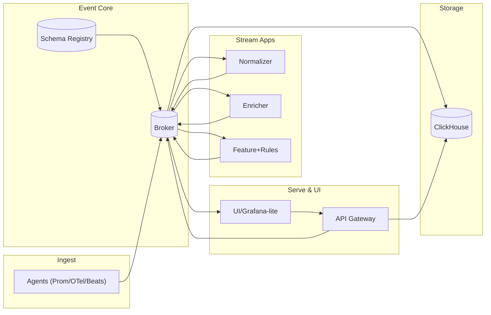

# ⚙️ EventOps Flow — MVP Architecture

**Collect → Normalize → Enrich → Store → Automate → Process → Serve**

> A minimal, event-driven backbone to turn telemetry into intelligent, automated signals.

---

## 🧭 Overview

**EventOps Flow** is a modular **EventOps / DataOps** framework that unifies data ingestion, normalization, enrichment, automation, and serving.
This MVP edition is intentionally small — a **seven-component stack** that you can spin up locally, extend with your own logic, and evolve into a production event pipeline.

### 🔁 Dataflow lifecycle

```
Collect → Normalize → Enrich → Store (ClickHouse) → Automate (Rules) → Process → Expose (API/UI)
```

---

## 📊 Architecture at a Glance



---

## 🧩 Core Components

| Service             | Purpose                               | Example Tech               |
| ------------------- | ------------------------------------- | -------------------------- |
| **broker**          | Event transport layer                 | Redpanda / Kafka           |
| **schema-registry** | Avro contracts and validation         | Redpanda Schema Registry   |
| **normalizer**      | Cleans and standardizes incoming data | Python + confluent-kafka   |
| **enricher**        | Adds metadata / context               | Python microservice        |
| **feature-rules**   | Detects conditions, creates alerts    | Python + ClickHouse client |
| **clickhouse**      | Fast analytical storage               | ClickHouse Server          |
| **api**             | Query metrics + stream alerts         | FastAPI                    |
| **ui**              | Simple web frontend / Grafana         | HTML/JS or Grafana-Lite    |

---

## 🧱 Topics and Schemas

| Topic               | Purpose                      | Retention | Notes           |
| ------------------- | ---------------------------- | --------- | --------------- |
| `ingest.raw.agent`  | Raw metrics/logs from agents | 3 days    | Input topic     |
| `signals.metric.v1` | Normalized metrics           | 14 days   | No compaction   |
| `ops.alert.v1`      | Rule-based alerts            | 30 days   | Compaction = on |

**Envelope Schema (`monitoring.envelope.v1`)**

```json
{
  "type":"record","name":"Envelope","namespace":"monitoring.v1",
  "fields":[
    {"name":"event_id","type":"string"},
    {"name":"ts_event","type":"string"},
    {"name":"ts_ingest","type":"string"},
    {"name":"tenant_id","type":"string"},
    {"name":"source", "type":{"type":"record","name":"Source",
      "fields":[{"name":"type","type":"string"},{"name":"source_id","type":"string"}]}},
    {"name":"schema_name","type":"string"},
    {"name":"schema_version","type":"int"},
    {"name":"attributes","type":{"type":"map","values":"string"}},
    {"name":"tags","type":{"type":"map","values":"string"}}
  ]
}
```

---

## 🐳 Docker Compose (MVP Core)

```yaml
version: "3.9"
services:
  broker:
    image: redpandadata/redpanda:latest
    command: ["redpanda","start","--overprovisioned","--smp","1","--memory","1G",
              "--reserve-memory","0M","--node-id","0",
              "--kafka-addr","0.0.0.0:9092","--advertise-kafka-addr","broker:9092",
              "--rpc-addr","0.0.0.0:33145","--advertise-rpc-addr","broker:33145",
              "--pandaproxy-addr","0.0.0.0:8082","--advertise-pandaproxy-addr","broker:8082"]
    ports: ["9092:9092","9644:9644","8081:8081","8082:8082"]

  schema-registry:
    image: docker.redpanda.com/vectorized/redpanda-schema-registry:latest
    environment:
      SCHEMA_REGISTRY_KAFKA_BROKERS: broker:9092
    ports: ["8081:8081"]

  clickhouse:
    image: clickhouse/clickhouse-server:24
    ports: ["8123:8123","9000:9000"]
    volumes: ["ch_data:/var/lib/clickhouse"]

  normalizer:
    build: ./normalizer
    environment: { BROKERS: broker:9092, SCHEMA_URL: http://schema-registry:8081 }
    depends_on: [broker, schema-registry]

  enricher:
    build: ./enricher
    environment: { BROKERS: broker:9092 }
    depends_on: [broker]

  feature-rules:
    build: ./feature-rules
    environment: { BROKERS: broker:9092 }
    depends_on: [broker]

  api:
    build: ./api
    environment:
      CLICKHOUSE_URL: http://clickhouse:8123
      BROKERS: broker:9092
    ports: ["8088:8088"]
    depends_on: [clickhouse, broker]

  ui:
    build: ./ui
    ports: ["8080:80"]
    depends_on: [api]

volumes:
  ch_data:
```

> Swap Redpanda for Kafka if preferred — all contracts remain compatible.

---

## 🧪 Quick Start

```bash
# Clone repository
git clone https://github.com/<yourname>/eventops-flow.git
cd eventops-flow

# Build and run MVP stack
docker compose up -d

# Simulate agent metric
kcat -b localhost:9092 -t ingest.raw.agent -P <<EOF
{"tenant_id":"acme","host":"host-a","metric":"cpu_load","value":92,
 "ts_event":"2025-10-16T09:00:00Z","unit":"percent","tags":{"env":"prod"}}
EOF

# Query metrics
curl "http://localhost:8088/metrics/cpu?tenant=acme&host=host-a"

# Watch alerts (Server-Sent Events)
curl -N http://localhost:8088/alerts/stream
```

---

## 🧠 Why This MVP Works

* **Minimal moving parts** — one broker, one registry, three microservices, one store, one API.
* **Contract-first design** — Avro envelope ensures forward-compatible schemas.
* **Fully replayable** — rebuild state by replaying topics into ClickHouse.
* **Scalable path** — swap microservices for Flink, ksqlDB, or Temporal as needed.
* **Composable** — add OpenSearch, Neo4j, or Qdrant downstream without schema change.

---

## 🧰 Repository Layout

```
eventops-flow/
├── normalizer/         # cleans and standardizes agent events
├── enricher/           # adds context/CMDB data
├── feature-rules/      # computes features, triggers alerts
├── api/                # FastAPI service exposing queries + alerts stream
├── ui/                 # minimal web or Grafana-lite UI
├── docker-compose.yml
└── README.md
```

---

## 🔮 Next Steps

* Add `signals.log.v1` and `signals.trace.v1` for observability logs/traces
* Separate `signals.enriched.v1` for richer joins
* Introduce `ctrl.command.v1` for closed-loop automation
* Implement multi-tenant ACLs and per-tenant retention
* Plug in Flink, n8n, or Temporal for advanced automation

---

## 📜 License

MIT License — free for use, modification, and extension.

---

## ✨ Vision

> Build once, extend infinitely.
> **EventOps Flow** turns streams into structure, structure into insight, and insight into automated action.

