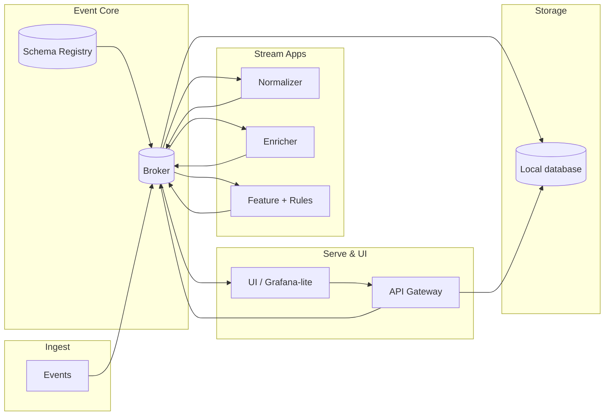

# ⚙️ MVP (Minimum Value Product) - EventOps Flow

**Collect → Normalize → Enrich → Store → Automate → Process → Serve**

> A minimal, event-driven pipeline turning raw telemetry into intelligent actions —
> no external database, just lightweight local storage powered by **DuckDB + Parquet**.

---

## 🧭 Overview

**EventOps Flow** is a modular **EventOps / DataOps** framework that connects data ingestion, normalization, enrichment, and automation into a single developer-friendly pipeline.

This **Local Store Edition** for fast analytics and zero-config persistence — ideal for prototyping, local testing, or edge deployments.

---

## 📊 Architecture at a Glance



---

## 🧩 Core Components

| Service             | Purpose                     | Technology               |
| ------------------- | --------------------------- | ------------------------ |
| **broker**          | Event transport             | Redpanda / Kafka         |
| **schema-registry** | Schema validation           | Redpanda Registry        |
| **normalizer**      | Cleans & standardizes input | Python + confluent-kafka |
| **enricher**        | Adds context (CMDB, tags)   | Python                   |
| **feature-rules**   | Generates alerts            | Python                   |
| **local store**     | File-based analytics        | DuckDB + Parquet         |
| **api**             | Query + SSE alerts          | FastAPI + DuckDB         |
| **ui**              | Minimal web or Grafana view | HTML / JS                |

---

## 🧱 Topics and Schemas

| Topic               | Purpose             | Retention | Notes         |
| ------------------- | ------------------- | --------- | ------------- |
| `ingest.raw.agent`  | Raw agent telemetry | 3 d       | Input         |
| `signals.metric.v1` | Normalized metrics  | 14 d      | No compaction |
| `ops.alert.v1`      | Rule-based alerts   | 30 d      | Compaction on |

**Envelope Schema (`monitoring.envelope.v1`):**

```json
{
  "type": "record",
  "name": "Envelope",
  "namespace": "monitoring.v1",
  "fields": [
    {"name":"event_id","type":"string"},
    {"name":"ts_event","type":"string"},
    {"name":"ts_ingest","type":"string"},
    {"name":"tenant_id","type":"string"},
    {"name":"source","type":{
      "type":"record","name":"Source",
      "fields":[{"name":"type","type":"string"},{"name":"source_id","type":"string"}]
    }},
    {"name":"schema_name","type":"string"},
    {"name":"schema_version","type":"int"},
    {"name":"attributes","type":{"type":"map","values":"string"}},
    {"name":"tags","type":{"type":"map","values":"string"}}
  ]
}
```

---

## 🐳 Docker Compose (MVP Core)

```yaml
version: "3.9"
services:
  broker:
    image: redpandadata/redpanda:latest
    command: ["redpanda","start","--overprovisioned","--smp","1","--memory","1G",
              "--reserve-memory","0M","--node-id","0",
              "--kafka-addr","0.0.0.0:9092","--advertise-kafka-addr","broker:9092",
              "--rpc-addr","0.0.0.0:33145","--advertise-rpc-addr","broker:33145",
              "--pandaproxy-addr","0.0.0.0:8082","--advertise-pandaproxy-addr","broker:8082"]
    ports: ["9092:9092","9644:9644","8081:8081","8082:8082"]

  schema-registry:
    image: docker.redpanda.com/vectorized/redpanda-schema-registry:latest
    environment:
      SCHEMA_REGISTRY_KAFKA_BROKERS: broker:9092
    ports: ["8081:8081"]

  normalizer:
    build: ./normalizer
    environment: { BROKERS: broker:9092, SCHEMA_URL: http://schema-registry:8081 }
    depends_on: [broker, schema-registry]
    volumes: ["data:/data"]

  enricher:
    build: ./enricher
    environment: { BROKERS: broker:9092 }
    depends_on: [broker]
    volumes: ["data:/data"]

  feature-rules:
    build: ./feature-rules
    environment: { BROKERS: broker:9092 }
    depends_on: [broker]
    volumes: ["data:/data"]

  api:
    build: ./api
    environment:
      BROKERS: broker:9092
      DATA_DIR: /data
      DUCKDB_PATH: /data/metrics.duckdb
    ports: ["8088:8088"]
    depends_on: [broker]
    volumes: ["data:/data"]

  ui:
    build: ./ui
    ports: ["8080:80"]
    depends_on: [api]

volumes:
  data:
```

---

## 🗃️ Local Store Layout

```
/data/
  metrics.duckdb
  parquet/
    tenant=acme/metric=cpu_load/date=2025-10-16/part-0001.parquet
```

---

## 🧪 Quick Start

```bash
# 1️⃣  Clone and launch
git clone https://github.com/<yourname>/eventops-flow.git
cd eventops-flow
docker compose up -d

# 2️⃣  Simulate agent metric
kcat -b localhost:9092 -t ingest.raw.agent -P <<EOF
{"tenant_id":"acme","host":"host-a","metric":"cpu_load","value":92,
 "ts_event":"2025-10-16T09:00:00Z","unit":"percent","tags":{"env":"prod"}}
EOF

# 3️⃣  Query metrics
curl "http://localhost:8088/metrics/cpu?tenant=acme&host=host-a"

# 4️⃣  Watch live alerts
curl -N http://localhost:8088/alerts/stream
```

---

## 🧰 Inspect Local Data

```bash
# open DuckDB shell
duckdb data/metrics.duckdb "SELECT COUNT(*) FROM metrics;"
# export sample
duckdb data/metrics.duckdb "COPY (SELECT * FROM metrics LIMIT 100) TO 'sample.parquet' (FORMAT PARQUET);"
```

---

## 🔄 Extend / Migrate

* Add new topics (`signals.log.v1`, `signals.trace.v1`)
* Swap local sink for ClickHouse, PostgreSQL, or Qdrant later
* Keep envelope schema intact for contract-first evolution
* Plug in n8n / Flink / Temporal for richer automation

---

## 📦 Repository Layout

```
eventops-flow/
├── normalizer/
├── enricher/
├── feature-rules/
│   └── local_sink.py
├── api/
├── ui/
├── docker-compose.yml
└── README.md
```

---

## ✅ Why Local Store

* 🧩 Zero external dependencies
* ⚡ Fast analytical queries (vectorized engine)
* 📂 Portable & human-readable files
* 🔒 Perfect for laptops, edge nodes, or demos

---

## 📜 License

MIT License — Free for use, modification, and extension.

---

## ✨ Vision

> **EventOps Flow** bridges raw data and intelligent automation.
> From lightweight local demos to enterprise data fabrics,
> the same pattern scales — **one envelope, one event bus, infinite possibilities.**
