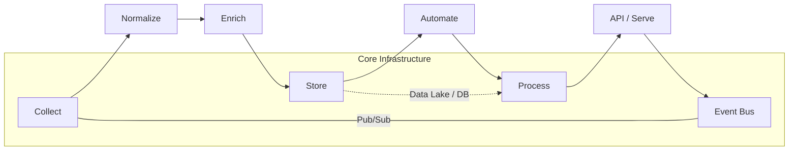

# MVP-EventOps-Framework

Perfect. Here’s a **complete, production-ready `README.md`** draft for your GitHub repository — based on your framework idea:

---

# 🧠 EventOps Flow

**From Data to Action — A Modular Event-Driven Framework**

---

## 🚀 Overview

**EventOps Flow** is a modular, event-driven framework designed to transform **raw data** into **actionable intelligence**.
It follows a clear and extensible lifecycle:

> **Collect → Normalize → Enrich → Store → Automate → Process → Expose (API) → Distribute (Event Bus)**

Built for **real-time systems**, **AI-powered data pipelines**, and **automation backbones**, EventOps Flow bridges the gap between *data operations (DataOps)*, *event streaming (EDA)*, and *intelligent automation (MLOps/AI-Ops)*.

---

## 🧩 Core Principles

| Stage                      | Purpose                            | Example Tools                             |
| -------------------------- | ---------------------------------- | ----------------------------------------- |
| **Collect**                | Ingest data from multiple sources  | MQTT, Kafka Connect, REST, Webhooks       |
| **Normalize**              | Standardize schemas and structures | FastAPI, Pydantic, Avro, JSON Schema      |
| **Enrich**                 | Add metadata, context, embeddings  | Python microservices, LLMs, external APIs |
| **Store (Sink)**           | Persist enriched data              | ClickHouse, PostgreSQL, Qdrant, MinIO     |
| **Automate**               | Trigger workflows, alerts, actions | n8n, Temporal, Apache Airflow             |
| **Process**                | Run analytics, transformations, ML | Flink, Spark, LangChain agents            |
| **Expose (API)**           | Provide query / serve endpoints    | FastAPI, GraphQL, gRPC                    |
| **Distribute (Event Bus)** | Deliver to subscribers             | Pulsar, Kafka, Redis Streams              |

---

## 🧠 Architecture



---

## 🛠️ Tech Stack

| Layer          | Example Technology                |
| -------------- | --------------------------------- |
| **Messaging**  | Apache Pulsar / Kafka             |
| **Storage**    | ClickHouse, PostgreSQL, Qdrant    |
| **Processing** | Python, FastAPI, LangChain, Flink |
| **Automation** | n8n, Temporal, Celery             |
| **Monitoring** | Prometheus, Grafana               |
| **Deployment** | Docker Compose / Kubernetes       |

---

## 💡 Use Cases

* **IoT Telemetry Processing** – normalize sensor data, enrich with context, and trigger alerts.
* **Knowledge Graph Enrichment** – collect documents, embed, and store in vector DB.
* **Security Automation** – detect anomalies and initiate automated response workflows.
* **Business Intelligence** – turn streaming data into dashboards and automated reports.
* **AI Agent Backends** – feed structured event streams to decision-making LLMs.

---

## 📦 Repository Structure

```
eventops-flow/
├── services/
│   ├── collector/          # Data ingestion endpoints
│   ├── normalizer/         # Schema & format normalization
│   ├── enricher/           # Adds metadata or embeddings
│   ├── sink/               # Writes to ClickHouse/Qdrant
│   ├── processor/          # Rules / analytics / ML
│   ├── automation/         # n8n / Temporal tasks
│   ├── api/                # REST / GraphQL endpoints
│   └── bus/                # Event message broker
├── docker-compose.yml
├── .env.example
├── Makefile
└── README.md
```

---

## ⚙️ Quick Start

```bash
# Clone the repository
git clone https://github.com/<yourname>/eventops-flow.git
cd eventops-flow

# Spin up the full stack
docker compose up -d

# Access the API
http://localhost:8080/docs
```

---

## 🌍 Example Workflow

1. **Collect:** MQTT sensor publishes `temperature: 32°C`
2. **Normalize:** Converted to `{ "sensor": "A1", "temp_c": 32.0, "timestamp": ... }`
3. **Enrich:** Add metadata `{ "location": "Greenhouse 3", "risk": "High" }`
4. **Store:** Save record to ClickHouse and vector store (Qdrant)
5. **Automate:** Trigger workflow → send alert → adjust cooling system
6. **Expose:** API returns aggregated stats
7. **Distribute:** Event bus pushes updates to dashboards

---

## 🧰 Extending the Framework

Add a new component under `/services` and register it in the event topology:

```python
# Example: register new enrichment service
@event_bus.subscribe("normalize.output")
def enrich_message(event):
    enriched = enrich(event)
    event_bus.publish("enrich.output", enriched)
```

---

## 🧪 Development Mode

```bash
# Lint & format
make lint

# Run tests
pytest -v

# View logs
docker compose logs -f
```

---

## 📊 Observability

* **Prometheus metrics** exposed on `:9090`
* **Grafana dashboards** available at `:3000`
* **Structured logs** with correlation IDs per event

---

## 🔗 Related Concepts

* [DataOps](https://en.wikipedia.org/wiki/DataOps)
* [Event-Driven Architecture (EDA)](https://martinfowler.com/articles/201701-event-driven.html)
* [Streaming Data Pipelines](https://kafka.apache.org/documentation/streams/)
* [KnowledgeOps & Cognitive Automation](https://research.ibm.com/publications/cognitive-automation)

---

## 📜 License

MIT License — free to use, modify, and extend.
Contributions and pull requests are welcome!

---

## ✨ Vision

> **EventOps Flow** aims to be a universal backbone for **intelligent, event-driven data automation**, bridging the gap between raw telemetry, contextual knowledge, and automated reasoning.

---

Would you like me to generate the **matching `docker-compose.yml` skeleton** and folder layout for this README (so you can push it as a starter repo)?

