I'll create a comprehensive project timeline for implementing this cutting-edge AI/ML architecture.I've created a comprehensive 12-month Gantt chart timeline for implementing the cutting-edge AI/ML platform. Here's the strategic breakdown:

## **Phase Overview:**

**Phase 1: Foundation (Months 1-3)**
- Core infrastructure, Kubernetes, CI/CD, security, and monitoring baseline

**Phase 2: Data Layer (Months 2-4)**
- Data ingestion with streaming and batch processing, initial storage setup

**Phase 3: Advanced Storage (Months 3-5)**
- Vector DB, Graph DB, Feature Store - the specialized data layer

**Phase 4: ML Foundation (Months 4-6)**
- Model registry, serving infrastructure, and training pipelines

**Phase 5: LLM Integration (Months 5-7)**
- LLM gateway, commercial and local models, fine-tuning capabilities

**Phase 6: RAG & Retrieval (Months 6-8)**
- Advanced retrieval system with hybrid search and semantic caching

**Phase 7: AI Agents (Months 7-9)**
- Multi-agent orchestration with specialized agents and communication protocols

**Phase 8: ML Models (Months 6-9)**
- Traditional ML models for anomaly detection, forecasting, and classification

**Phase 9: Anomaly System (Months 8-10)**
- Real-time detection with explainability and intelligent alerting

**Phase 10: MLOps Advanced (Months 9-11)**
- Production-grade monitoring, drift detection, and auto-retraining

**Phase 11: Production Hardening (Months 10-12)**
- Performance optimization, disaster recovery, and security hardening

**Phase 12: Integration & Launch (Months 11-12)**
- Final integration, testing, and production deployment

**Continuous Activities** run throughout the entire timeline for documentation, training, security, and monitoring.

```mermaid
gantt
    title Advanced AI/ML Platform - 12 Month Implementation Timeline
    dateFormat YYYY-MM-DD
    
    section Phase 1: Foundation (Months 1-3)
    Infrastructure Setup           :infra, 2025-11-01, 30d
    Kubernetes & DevOps           :k8s, after infra, 20d
    CI/CD Pipelines               :cicd, after k8s, 15d
    Security & Auth               :sec, after infra, 25d
    API Gateway Setup             :api, after sec, 10d
    Monitoring Foundation         :mon1, after k8s, 15d
    
    section Phase 2: Data Layer (Months 2-4)
    Object Storage & Data Lake    :storage, 2025-12-01, 20d
    Event Streaming (Kafka)       :kafka, after storage, 25d
    Time Series DB                :tsdb, after storage, 15d
    Batch Pipeline (Airflow)      :batch, after kafka, 20d
    Real-time ETL (Flink)         :etl, after kafka, 30d
    Data Quality Framework        :dq, after etl, 20d
    
    section Phase 3: Advanced Storage (Months 3-5)
    Vector Database Setup         :vecdb, 2026-01-15, 25d
    Graph Database Deploy         :graphdb, after vecdb, 20d
    Cache Layer (Redis)           :cache, 2026-01-15, 15d
    Feature Store (Feast)         :feat, after cache, 30d
    Data Governance               :gov, after feat, 20d
    
    section Phase 4: ML Foundation (Months 4-6)
    Model Registry (MLflow)       :registry, 2026-02-15, 20d
    Experiment Tracking           :exp, after registry, 15d
    Model Serving Infrastructure  :serve, after registry, 25d
    Training Pipeline             :train, after serve, 30d
    Feature Engineering Pipeline  :feeng, after feat, 25d
    
    section Phase 5: LLM Integration (Months 5-7)
    LLM Gateway Setup             :llmgw, 2026-03-15, 20d
    Commercial LLM Integration    :comm, after llmgw, 15d
    Local LLM Deployment          :local, after comm, 25d
    Fine-tuning Pipeline          :finetune, after local, 30d
    Prompt Management             :prompt, after llmgw, 20d
    Vector Embeddings Generator   :embed, after vecdb, 25d
    
    section Phase 6: RAG & Retrieval (Months 6-8)
    RAG System Foundation         :rag1, 2026-04-15, 25d
    Hybrid Search Implementation  :hybrid, after rag1, 20d
    Context Management            :context, after hybrid, 15d
    RAG Optimization              :ragopt, after context, 20d
    Semantic Caching              :semcache, after ragopt, 15d
    
    section Phase 7: AI Agents (Months 7-9)
    Agent Orchestrator Setup      :orch, 2026-05-15, 30d
    Tool Registry                 :tools, after orch, 20d
    Agent Memory System           :memory, after tools, 25d
    Code Agent                    :codeag, after memory, 20d
    Data Analysis Agent           :dataag, after memory, 20d
    Research Agent                :resag, after memory, 20d
    Planning Agent                :planag, after codeag, 15d
    Agent Communication Protocol  :agcom, after planag, 15d
    
    section Phase 8: ML Models (Months 6-9)
    Anomaly Detection Models      :anom, 2026-04-01, 35d
    Forecasting Models            :forecast, after anom, 25d
    Classification Models         :class, after anom, 25d
    Model Ensemble Framework      :ensemble, after forecast, 20d
    AutoML Pipeline               :automl, after ensemble, 25d
    
    section Phase 9: Anomaly System (Months 8-10)
    Real-time Detection Engine    :rtdet, 2026-06-15, 30d
    Rule Engine                   :rules, after rtdet, 20d
    Explainability Module (SHAP)  :shap, after rules, 25d
    Alert Manager                 :alert, after shap, 20d
    Feedback Loop                 :feedback, after alert, 15d
    
    section Phase 10: MLOps Advanced (Months 9-11)
    Model Monitoring (Evidently)  :mlmon, 2026-07-15, 25d
    Drift Detection               :drift, after mlmon, 20d
    A/B Testing Framework         :abtest, after drift, 25d
    Auto-retraining Pipeline      :retrain, after abtest, 20d
    Model Governance              :mlgov, after retrain, 15d
    
    section Phase 11: Production Hardening (Months 10-12)
    Load Testing & Optimization   :load, 2026-08-15, 20d
    Disaster Recovery             :dr, after load, 25d
    Advanced Observability        :obs, after dr, 20d
    Cost Optimization             :cost, after obs, 15d
    Security Audit                :audit, after cost, 20d
    Performance Tuning            :perf, after audit, 15d
    
    section Phase 12: Integration & Launch (Months 11-12)
    API Documentation             :apidoc, 2026-09-15, 15d
    SDK Development               :sdk, after apidoc, 20d
    Integration Testing           :inttest, after sdk, 25d
    User Acceptance Testing       :uat, after inttest, 15d
    Production Deployment         :prod, after uat, 10d
    Post-launch Monitoring        :postlaunch, after prod, 20d
    
    section Continuous Activities
    Documentation                 :docs, 2025-11-01, 365d
    Team Training                 :training, 2025-11-15, 350d
    Security Updates              :secup, 2025-11-01, 365d
    Performance Monitoring        :perfmon, 2025-12-01, 335d
```

